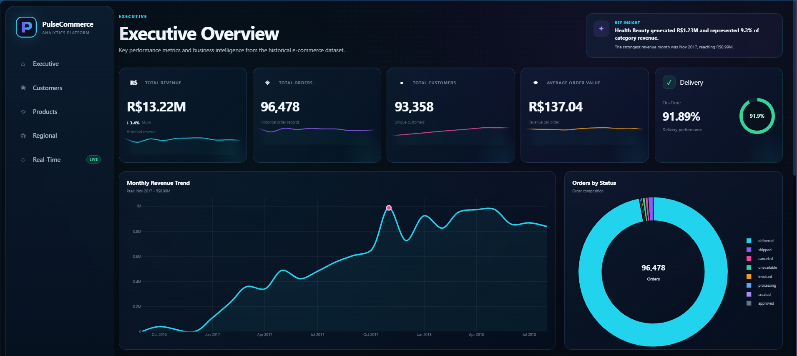
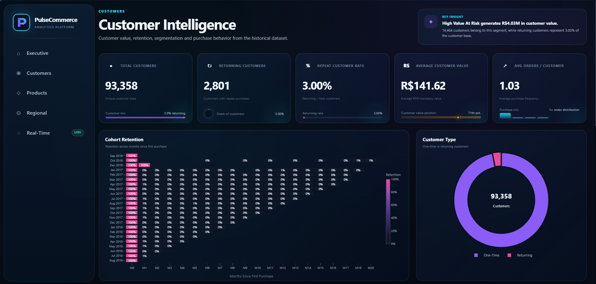
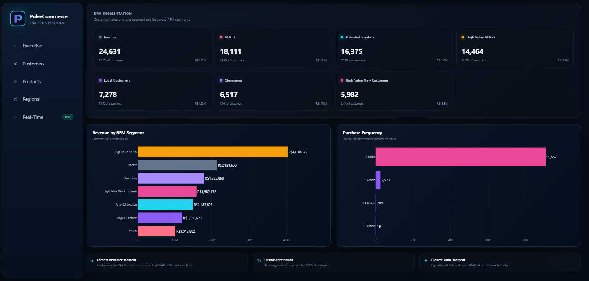
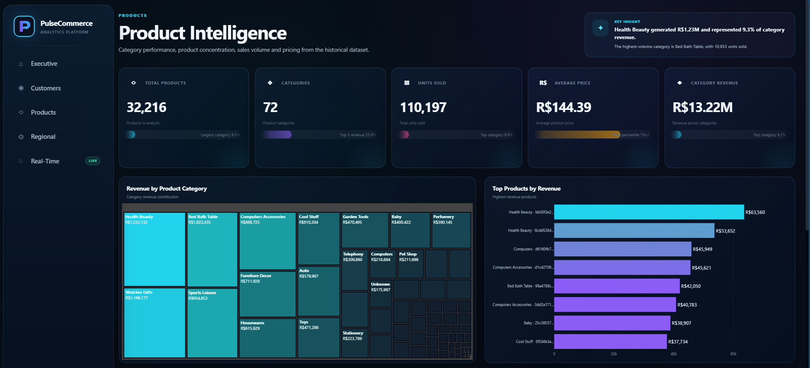
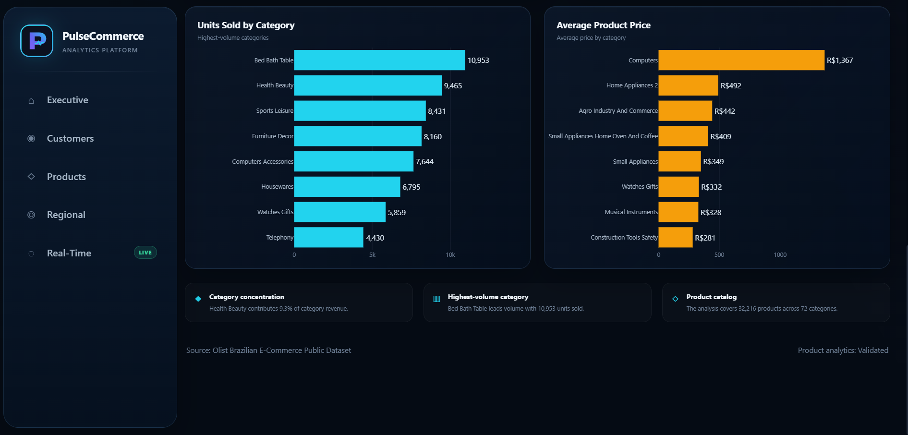
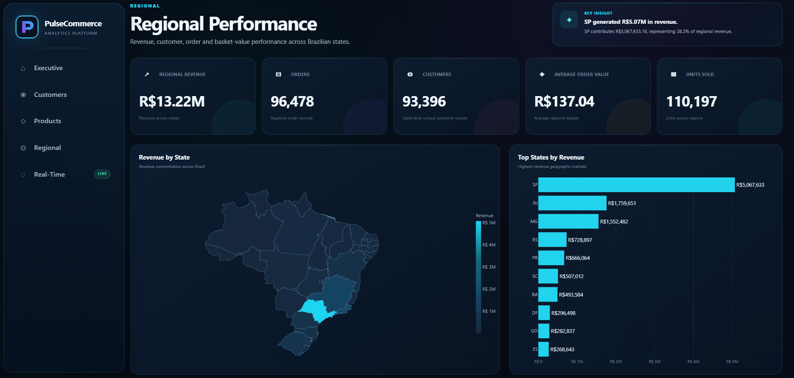
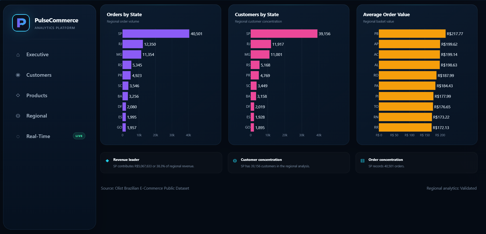
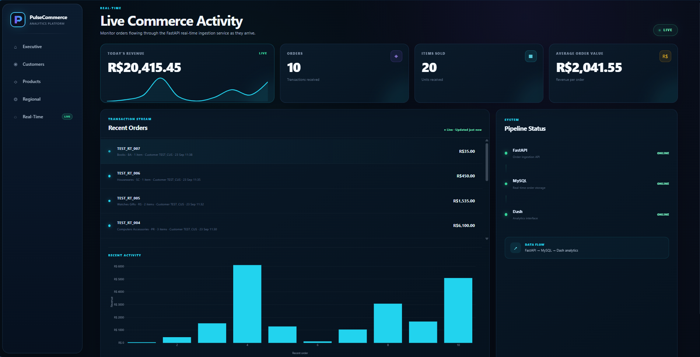
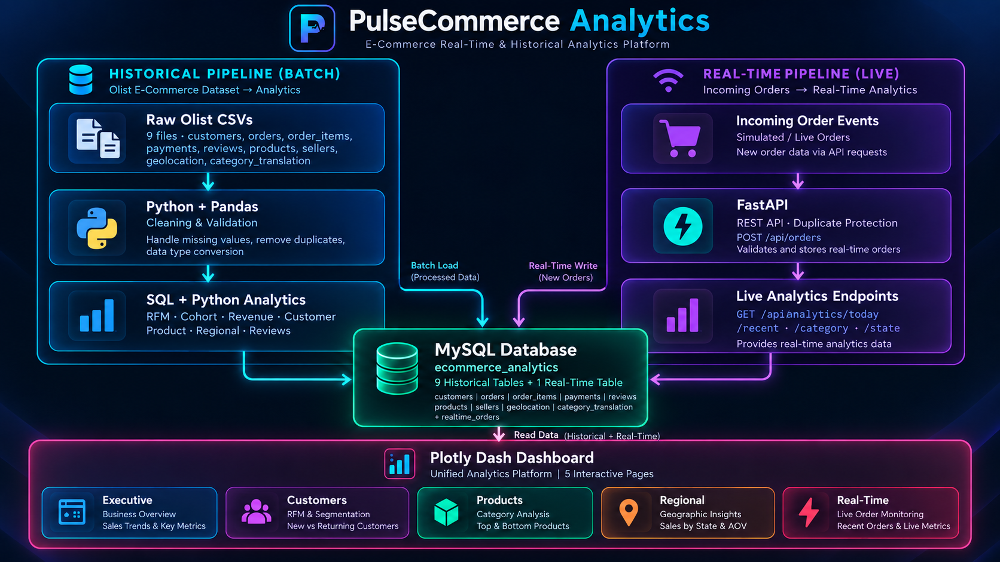

# PulseCommerce Analytics Platform

<div align="center">

> **Real-Time & Historical E-Commerce Analytics**

A portfolio-grade analytics platform that transforms Brazilian e-commerce transaction data into interactive business intelligence, while also supporting real-time order ingestion and monitoring.

**Python · Pandas · MySQL · FastAPI · Plotly Dash**

[](https://www.python.org/)
[](https://www.mysql.com/)
[](https://fastapi.tiangolo.com/)
[](https://dash.plotly.com/)


<p align="center">
  <a href="#-dashboard-preview">
    
  </a>
  <a href="#-architecture">
    
  </a>
  <a href="#-getting-started">
    
  </a>
</p>
</div>

---

<details>
<summary>
  <strong>📚 Explore PulseCommerce</strong>
</summary>

<br>

| Section | Explore |
| :--- | :--- |
| 📊 **Dashboard Preview** | [View Dashboard](#-dashboard-preview) |
| 🏗️ **Architecture** | [View Architecture](#-architecture) |
| 📦 **What the Platform Delivers** | [Explore](#-what-the-platform-delivers) |
| 📈 **Analytics Highlights** | [Explore](#-analytics-highlights) |
| 🧰 **Technology Stack** | [View Stack](#-technology-stack) |
| 🔄 **Data Pipeline** | [View Pipeline](#-data-pipeline) |
| 🗃️ **Dataset** | [View Dataset](#-dataset) |
| 🗂️ **Project Structure** | [View Structure](#-project-structure) |
| 🚀 **Getting Started** | [Get Started](#-getting-started) |
| ▶️ **Run the Platform** | [Run Platform](#-run-the-platform) |
| 🔌 **API Surface** | [View API](#-api-surface) |
| 🧪 **Data Quality** | [View Quality](#-data-quality) |
| 🧹 **Repository Hygiene** | [View Hygiene](#-repository-hygiene) |
| 🔮 **Future Extensions** | [Explore](#-future-extensions) |
| 👤 **Author** | [About](#-author) |

<br>

</details>

---

## ✦ Dashboard Preview

PulseCommerce is organized around five focused analytical experiences.

<details open>
<summary><strong>📊 Executive</strong></summary>

Business-level performance overview with revenue, orders, customer growth, AOV, order status, and historical trends.



</details>

<details open>
<summary><strong>👥 Customers</strong></summary>

Customer intelligence combining customer types, RFM segmentation, cohort retention, purchase behavior, and customer value.





</details>

<details open>
<summary><strong>🛍️ Products</strong></summary>

Product and category performance across revenue, product contribution, units sold, pricing, and category distribution.





</details>

<details open>
<summary><strong>🌎 Regional</strong></summary>

Brazilian state-level performance with geographic distribution, revenue, orders, customers, units sold, and AOV.





</details>

<details open>
<summary><strong>⚡ Real-Time</strong></summary>

Live order monitoring powered by FastAPI and MySQL, including recent activity, incoming orders, and pipeline status.



</details>

---

## 🏗️ Architecture

PulseCommerce uses two complementary pipelines that converge into a shared MySQL data layer and feed a unified Plotly Dash application.



### Historical Pipeline

**Olist CSVs → Python/Pandas → Cleaning & Validation → MySQL → SQL/Python Analytics → Dashboard**

Historical workflows cover revenue, customers, RFM, cohorts, products, regions, orders, payments, reviews, delivery, sellers, and statistical analysis.

### Real-Time Pipeline

**Incoming Orders → FastAPI → SQLAlchemy/MySQL → Analytics Endpoints → Real-Time Dashboard**

The live workflow supports order ingestion with duplicate protection and analytics endpoints for current, recent, category, and state-level activity.

---

## 📦 What the Platform Delivers

| Area | Analytics |
| :--- | :--- |
| **📊 Executive** | Revenue, orders, customer growth, AOV, order status, delivery performance |
| **👥 Customers** | Customer types, RFM segmentation, cohort retention, purchase behavior |
| **🛍️ Products** | Category revenue, top products, units sold, pricing, product concentration |
| **🌎 Regional** | State revenue, orders, customers, units sold, AOV, geographic distribution |
| **⚡ Real-Time** | Order ingestion, recent orders, activity, pipeline status |
| **🧪 Data Quality** | Missing values, relationships, validation, business-field profiling |

<br>

All monetary values shown in the dashboard use **Brazilian Real (`R$`)**.

---

## 📈 Analytics Highlights

### 👥 Customer Intelligence

- RFM segmentation
- Cohort retention analysis
- Customer type analysis
- Purchase frequency
- Customer value analysis
- Returning vs. one-time customer behavior

### 🛒 Commercial Analytics

- Monthly revenue trends
- Revenue by product category
- Top products
- Units sold
- Average product price
- Order basket analysis
- Payment analysis

### 🌎 Regional Intelligence

- State-level revenue
- State-level order volume
- Customer distribution
- Units sold by state
- Average order value
- Geographic performance visualization

### ⚙️ Operational Analytics

- Review score analysis
- Delivery analysis
- Seller analysis
- Statistical analysis
- Real-time order monitoring

---

## 🧰 Technology Stack

| Layer | Technologies |
| :--- | :--- |
| **🖥️ Frontend / BI** | Plotly Dash, Plotly |
| **⚡ Backend** | FastAPI, Pydantic |
| **🔗 Data Access** | SQLAlchemy, PyMySQL |
| **📊 Analytics** | Pandas, NumPy, SciPy |
| **📈 Visualization** | Plotly, Matplotlib, Seaborn |
| **🗄️ Database** | MySQL |
| **🐍 Language** | Python |
| **🌱 Environment** | Python virtual environment |

---

## 🔄 Data Pipeline

```text
┌───────────────────────┐
│   Olist Raw CSVs      │
│   9 source datasets   │
└───────────┬───────────┘
            │
            ▼
┌───────────────────────┐
│ Python + Pandas       │
│ Cleaning & Validation │
└───────────┬───────────┘
            │
            ▼
┌───────────────────────┐
│ Processed Analytical  │
│ Data                  │
└───────────┬───────────┘
            │
            ▼
┌───────────────────────┐
│       MySQL           │
│ Historical + Live     │
│ Order Data            │
└───────┬─────────┬─────┘
        │         │
        ▼         ▼
┌────────────┐ ┌───────────────┐
│ SQL +      │ │ FastAPI       │
│ Python     │ │ Real-Time API │
│ Analytics  │ │ + Analytics   │
└──────┬─────┘ └───────┬───────┘
       │               │
       └───────┬───────┘
               ▼
      ┌──────────────────┐
      │   Plotly Dash    │
      │ Unified Dashboard│
      └──────────────────┘
```

---

## 🗃️ Dataset

Historical analysis uses the **Brazilian E-Commerce Public Dataset by Olist**.

The project works with nine source datasets:

- Customers
- Geolocation
- Orders
- Order Items
- Order Payments
- Order Reviews
- Products
- Sellers
- Product Category Name Translation

The raw dataset is intentionally excluded from Git because of its size.

Place the source files locally in:

```text
data/raw/olist/
```

Generated analytical datasets are stored in:

```text
data/processed/
```

Both directories are excluded from repository tracking.

---

## 🗂️ Project Structure

<details>
<summary><strong>Click to expand full folder tree</strong></summary>

```text
ecommerce-analytics-platform/
│
├── api/
│   ├── database.py
│   ├── main.py
│   ├── models.py
│   ├── schemas.py
│   └── routes/
│       ├── analytics.py
│       └── orders.py
│
├── dashboard/
│   ├── app.py
│   ├── plotly_theme.py
│   ├── assets/
│   ├── components/
│   └── pages/
│       ├── executive.py
│       ├── customers.py
│       ├── products.py
│       ├── regional.py
│       └── realtime.py
│
├── data/
│   ├── raw/
│   └── processed/
│
├── docs/
│   ├── architecture.png
│   └── screenshots/
│
├── reports/
│   └── data_quality_report.csv
│
├── sql/
│   ├── 01_create_schema.sql
│   ├── 02_sales_analysis.sql
│   ├── 03_advanced_sales_analysis.sql
│   └── 04_realtime_schema.sql
│
├── src/
│   ├── analytics/
│   └── data/
│
├── .gitignore
├── requirements.txt
└── README.md
```

</details>

---

## 🚀 Getting Started

### Prerequisites

- Python 3.x
- MySQL
- Git

### 1. Clone the repository

```bash
git clone <your-github-repository-url>
cd ecommerce-analytics-platform
```

### 2. Create and activate a virtual environment

Windows PowerShell:

```powershell
python -m venv .venv
.\.venv\Scripts\Activate.ps1
```

### 3. Install dependencies

```powershell
pip install -r requirements.txt
```

### 4. Configure the database

Create the required MySQL database and configure the connection values expected by `api/database.py` in your local `.env` file.

Do not commit `.env`.

Database setup scripts are available in:

```text
sql/
```

### 5. Add the Olist dataset

Place the raw CSV files under:

```text
data/raw/olist/
```

### 6. Run the data preparation workflow

Use the scripts under:

```text
src/data/
```

for inspection, cleaning, validation, profiling, and database loading.

Use the workflows under:

```text
src/analytics/
```

to generate the analytical datasets used by the dashboard.

---

## ▶️ Run the Platform

PulseCommerce has two application processes.

### FastAPI

Start the backend:

```powershell
uvicorn api.main:app --reload
```

Health check:

```text
GET /health
```

### Plotly Dash

In a second terminal:

```powershell
python -m dashboard.app
```

The dashboard uses Dash Pages and loads the five views from:

```text
dashboard/pages/
```

---

## 🔌 API Surface

The backend provides real-time order and analytics functionality.

<details>
<summary><strong>Click to expand API reference</strong></summary>

| Endpoint | Purpose |
| :--- | :--- |
| `POST /orders` | Ingest a real-time order |
| `GET /analytics/today` | Today's real-time analytics |
| `GET /analytics/recent` | Recent order/activity analytics |
| `GET /analytics/category` | Category-level analytics |
| `GET /analytics/state` | State-level analytics |
| `GET /health` | API health check |

</details>

The exact request and response schemas are defined in:

```text
api/schemas.py
```

---

## 🧪 Data Quality

The project includes dedicated data-quality workflows for:

- Missing-value analysis
- Relationship validation
- Data cleaning
- Processed-data validation
- Business-field profiling
- Final analytical validation

The generated report is available at:

```text
reports/data_quality_report.csv
```

---

## 🧹 Repository Hygiene

The repository intentionally excludes local and generated content:

<details>
<summary><strong>What's excluded from version control</strong></summary>

```text
.env
.venv/
.idea/
__pycache__/
data/raw/
data/processed/
```

</details>

This keeps Git focused on application source code, analytics logic, SQL, documentation, reports, and dashboard assets.

---

## 🔮 Future Extensions

Potential future work includes:

- Additional real-time operational metrics
- Customer lifetime-value analysis
- Expanded predictive analytics
- Automated data-quality monitoring
- Additional analytical storytelling views
- Deployment automation

---

## 👤 Author

**Jaysinh Thakor**
Computer Science & Engineering Graduate, Nirma University

GitHub: `JAYSINH6094`

---

<div align="center">

<sub>PulseCommerce Analytics Platform · E-Commerce Analytics with Python, MySQL, FastAPI & Plotly Dash</sub>

</div>
